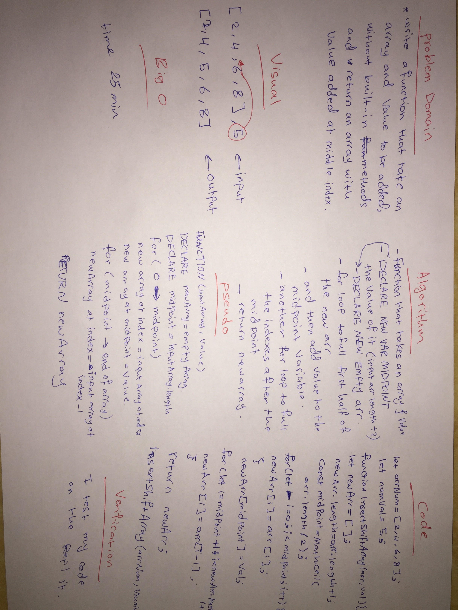

# data-structures-and-algorithms-401

# Reverse an Array code-challenge-01
We should know how to deal with the array, and the elements in the array.

## Challenge
 We should write a function called reverseArray which takes an array as an argument.Without utilizing any of the built-in methods available to your language, return an array with elements in reversed order.

## Approach & Efficiency
It's take around 15 min.

## Solution

# shift Array code-challenge-02
We should know how to deal with the array, and the elements in the array.

## Challenge
 Write a function called insertShiftArray which takes in an array and the value to be added. Without utilizing any of the built-in methods available to your language, return an array with the new value added at the middle index.

## Approach & Efficiency
It's take around 25 min.

## Solution
