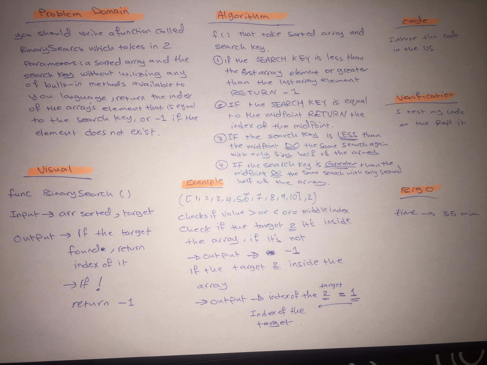

# data-structures-and-algorithms-401

# Binary search in a sorted 1D array (code-challenge-03)
We should know how to deal with the array, and the elements in the array.

## Challenge
 We should write a function called BinarySearch which takes in 2 parameters: a sorted array and the search key. Without utilizing any of the built-in methods available to your language, return the index of the array’s element that is equal to the search key, or -1 if the element does not exist.

## Approach & Efficiency
It's take around 35 min.

## Solution

